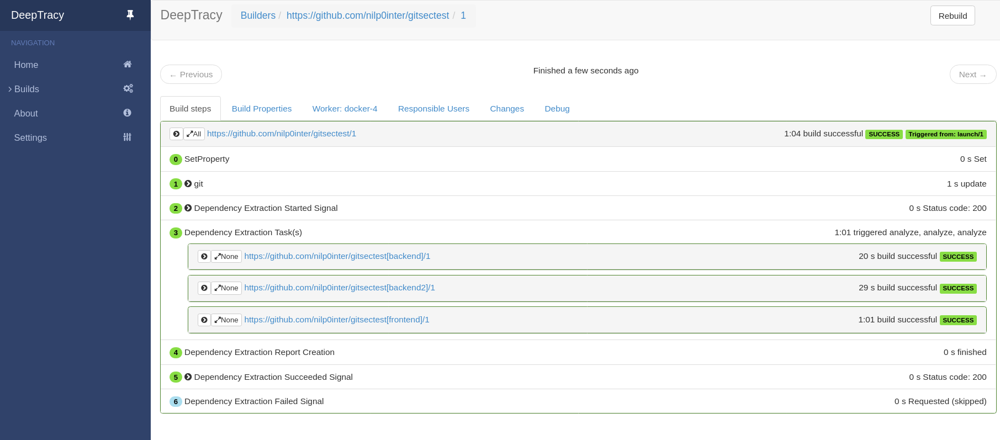
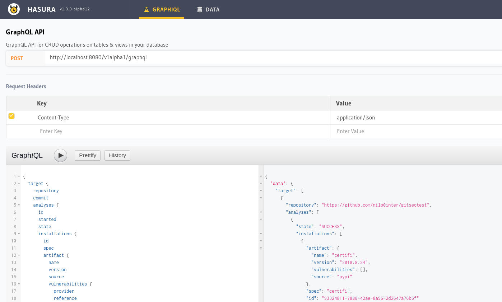

Quickstart
==========

All system components are provided as Docker containers and a docker-compose
configuration exists to assist the user on launching a testing environment.

Launching the Testing Environment
---------------------------------

The testing environment is managed through the `Makefile` present in the
project root directory.

.. code-block:: bash

   $ make

Executing the previous code in a Linux shell will setup a fresh testing
environment.

.. warning::

   The previous command will remove any existing data.

Testing Environment Services
----------------------------

The following table contains the list of open services on the Testing
Environment.

+--------------------+---------------------------------------+-----------------+
| Service            | URL                                   | Type            |
+====================+=======================================+=================+
| graphql-engine     | http://localhost:8080/console         | Web Application |
+--------------------+---------------------------------------+-----------------+
| graphql-engine     | http://localhost:8080/v1alpha/graphql | Web Application |
+--------------------+---------------------------------------+-----------------+
| deeptracy-server   | http://localhost:8088                 | REST API        |
+--------------------+---------------------------------------+-----------------+
| deeptracy-buildbot | http://localhost:8010                 | Web Application |
+--------------------+---------------------------------------+-----------------+

Buildbot
~~~~~~~~

Buildbot console provides a convenient way of debugging the status of the
Dependency Extraction Phase of Deeptracy.

Hasura
~~~~~~

Hasura Console helps the user on composing GraphQL queries.

Makefile Targets
----------------

The main `Makefile` provides some convenient targets.

`image`
~~~~~~~

Generate the main docker image used by `DeepTracy Server` and `buildbot`.

`start`
~~~~~~~

Bring up the testing environment using docker-compose.

`stop`
~~~~~~

Bring down the testing environment using docker-compose.

`down`
~~~~~~

Destroy the testing environment using docker-compose and remove all data.

`logs`
~~~~~~

Print the testing environment log files to stdout.

`status`
~~~~~~~~

Shows the status of the different components of the testing environment.

`plugins`
~~~~~~~~~

Build all plugin docker images.
